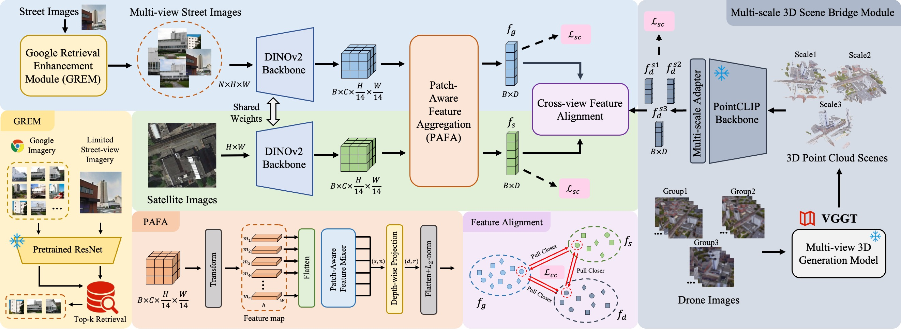

# SkyLink: Unifying Street-Satellite Geo-Localization via UAV-Mediated 3D Scene Alignment
- Official code for 2025 ACM'MM UAV Challenging paper, TeamName: XMUSmart;
- \textbf{News (2025.07.07): Comming Soon! Codes will be released upon the paper's publicationd.}

## Description 📜
Cross-view geo-localization aims at establishing location correspondences between different viewpoints. We focus on robust feature retrieval under viewpoint variation and propose the novel SkyLink method. Meanwhile, we integrate the 3D scene information constructed from multi-scale UAV images as a bridge between street and satellite viewpoints, and perform feature alignment through self-supervised and cross-view contrastive learning.

## Framework 🖇️
<td style="text-align: center"></td>
